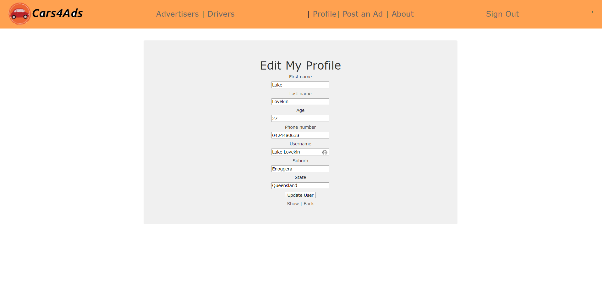

# T2A2 - Marketplace Project


### Deployed website here: https://cars4ads.herokuapp.com/

### Git Repository here: https://github.com/lukelovekin/LukeLovekin_T2A2


## The Application and its Purpose

Cars4Ads is a webpage designed to connect business owners, great and small, with car owners willing to rent some of their external car space for some extra cash.
Car owners can post ads with attractive details like showing their location, their usual driving routes, how far they drive on average, pictures of their car space with a description of the area of the car that they're happy to use as rent space. Otherwise, business owners can also post ads on the webpage showing their advertisement plans for a car, an image, size of the ad, its preferable location i.e the rear window or side doors, prefered area for the ad to be active

There is currently a webpage/business that allows the business owner or the car owner to contact this business via an online application of which then the applicant must wait to be contacted by this website once they have found a candidate. The problem Cars4Ads aims to solve is by allowing the business owners and car owners to deal with each other directly, immediately, more transparently while cutting out the unnecessarily highly profitable business in the middle. Also, by cutting out the middle man, the car owners and business owners will be able to negotiate on price or set a fixed price in their ads so either of the two can potentially expect to save or make more on their advertising costs and car rental profits. This problem needs to be solved to help the smaller businesses get into marketing their business more cost-effectively and allows them to have more control of where their advertisements get placed and who to, as well as potentially leaving more money in the pockets of both the business and car owner. 

The target audience for Cars4Ads will be, for the car owner users side of the webpage, anybody aged 17 to max driving age looking to make a bit of extra pocket money for going about their day as they would normally. Otherwise any age at all, for anyone looking to advertise their business or product in an easy, low-cost way. 

## Functionality and Features

Using Ads4Cars, from the home page, anyone can see all posts created by other users with the ability to filter driver or advertiser only ads. Once the user logs in they can create their posts as well as contact the owners of other posts, whether it's via a comment on their post page or contacting them using their contact details also shown on their post page. The drivers' posts will include details about the driver like where they're located, what car they have for advertising, where they travel often as well as the price they're happy to advertise for. The advertisers add will include information like, where they are looking for a driver, the ideal size of business logo, the price they're willing to pay. Both groups of posters will be able to attach images for a more successful post. 

<details closed>
<summary>Webpage Features</summary>

- Create an account with a secure password
- Authentication upon sign in
- Authorisation.
    - Allowing only owners of posts to edit and delete their posts
    - Allowing only users signed in to make new posts and comment on others posts
- The ability to create, read, update and delete posts and comments
- View everyone's posts on the homepage
- Contacting the owner of an add via comments.
- Filter ads buy driver ads or advertisers ads
- Upload many images to posts to help with the advertisement of an ad.
</details>

##  User Stories

<details closed>
<summary>MVP User Stories</summary>

Users can: 
- Create account/profile
- View all post without having to sign up
- Sign in, sign up, log out
- Create, edit, update and delete posts
- Navigate through pages with a top navbar
- Write and view comments to and from other users
- Attach images to their posts
- Access basic information about the site
- Filter posts using Driver or Advertiser categories
- Enjoy a nice design
</details>

## Sitemap


## Screenshots

<details closed>
<summary>Screenshots</summary>




</details>

##  Wireframes

<details closed>
<summary>Homepage</summary>


</details>

<details closed>
<summary>Show Post</summary>


</details>

<details closed>
<summary>Create Post</summary>


</details>

<details closed>
<summary>Signup</summary>


</details>

## Tech stack (e.g. html, css, deployment platform, etc)

<details closed>
<summary>Tech Stack</summary>

- Ruby on rails 
    - The server-side web framework. A model-view-controller framework that uses Ruby as the programming language
- Ruby
    - A programming language, version 2.7.1
- VsCode
    - Text editor
- Bootstrap & SCSS
    - one of the most popular frameworks for styling and making webpages responsive The code used for styling the website
    - Bootstrap also uses javascript for styling.
- Trello
    -  A Kanban software used to help with project management
- Lucid chart
    - Software used to draw Sitemaps and ERDs and other charts and diagrams
- Postgresql
    - Relational database management system which uses Structured query language (SQL) to set up the database and hold data for the webpage. 
- HTML 5
    - A hypertext Markup Language used to structure the web app.

</details>

<details closed>
<summary>Ruby Gems</summary>

Other than rails default gems, gems that were used include
- Devise
    - A very common, battle-tested, open-sourced gem used to authenticate new and existing user also making it easy for allowing user authorisation to hide certain things from certain users. Devise comes with views and controllers that can be used for almost any webpage
- aws-sdk-s3
    - This gem is needed in conjunction with active storage and Amazons S3 Bucket to store images on the internet

</details>

<details closed>
<summary>Third Party Services</summary>

- Heroku
    - An online deployment website/ server/cloud used for hosting my website
- Github
    - A git repository host online
- Amazon S3 Bucket
    - Stores images on the Amazon AWS cloud keeping image uploads dynamic and keeping the webpage from running slower
</details>

##  Explain the different high-level components (abstractions) in your app

Rails uses the MVC ( Model, View, Controller) architecture to create a webpage. The models, also known as the ActiveRecord, are the objects, in this case, users, posts, comments and images. These models include data fields and types and encloses data in the database which is Postgresql for this application. The view, also known as ActionView, is what the user sees and interacts with, the HTML, CSS and javascript. The controller, also known as ActionController, handles the decisions and processes and responds to events like user action and can make changes the views and the models.

Starting at the browser, the browser communicates to the controller which decides what to do next based on the users' actions. The controller communicates to the model when it needs to which then the using the model can communicate with the database and bring information back and sends the results to the view which will end up getting returned to the browser. 

## ERD


##  Cars4Ads Models Relationships

My projects models include User, Post, Comment and Active Storage Attachments. In Rails an association is the relation between two Active Record models. All models for this project have a belongs to and a one to many relation for e.g my User model can have zero or many instances of a post but a post model belongs to and can only have one user.

My User model
-  has_many :posts, dependent: :destroy
-  has_many :comments, dependent: :destroy
 My User model has many of the Post models and has many of the Comments model, both of which are dependent on the User model meaning if a User model along with all its data get deleted or destroyed so too with the Posts and Comments attached to it, this help with data integrity.

My Post model
- belongs_to :user
- has_many :comments, dependent: :destroy
- has_many_attached :post_pics
 My Post model belongs to the User model and can also have many of a Comments model as well Active Storage Attachments, both of which are dependent on the Post model.

My Comment model
- belongs_to :user
- belongs_to :post
My Comment model belongs to both the User model and Post model meaning if the user or the post it's attached to is removed then this model also gets destroyed.

The Active Storage has a polymorphic association meaning it can connect to multiple other models. This uses an Attachment join model which connects to a blob model which stores their identifier key and metadata in Rails Active storage service.

##  The Database Relations Implemented in the Application

Database relationships are when one table includes a foreign key that is a reference to another tables primary key. This primary key is a unique identifier for its table, by including a foreign key in a database table, the table that the foreign key refers to can be accessible by using this other model containing the foreign key. This way data can be called upon through Post and Comment model database queries without having to repeat data input. For example, my User model (and every other model) includes a primary key which is referenced with a foreign key in the Post and Comment model. My Posts and Comments both display User data when used on the webpage without having to store the data in their model tables. This normalizes the data, reduces redundancies, improves data integrity and helps prevent repeating code.

My Post model table includes a foreign key to reference both the User model table and the Active Storage model

My Comment model table includes a foreign key to the User model table and the post model table


##  Project Planning and Management

Trello Board Link: https://trello.com/b/hsy68wli/cars4ads

Starting with the planning stage of the project, after thoroughly going over the criteria of the assignment and Rubrik, I started with a Minimum Viable Product (MVP) idea. Starting with a Trello board, I split up the assignment's MVP requirements into To-Do cards as well as MVP user stories. The cards include checklists, dates to be completed as well as colour coded labels (red being MVP, most important) to highlight their importance as well as their difficulty/time cost. After the Trello board immediately set up and layout my Git Repositories ready for the rest of the project. In the assignments repo, I layout the README.md with everything it should include while placing the appropriate "HD" rubric goals under the matching headings so I know what I should be aiming for when completing the Documentation.

MVP initial Trello board at the start of the project


I refer back to the Trello board at least every morning and afternoon, if not every time I finish a task. I move cards that I aim to do on that day into the "Doing" column, move cards into the "Done" column when they are complete as well as constantly adding more User Stories and To Dos to their columns to at least aim to complete.

Once the Trello is up to date with MVP and Repos and Documentations are set up, the rest of the planning will continue, starting with at least a draft of all the documentation requirements including an ERD, Sitemap, Wireframes, functionality and features etc.

After planning stage, I made a start on code, starting with setting up models according to the already planned ERD, I then just keep picking and doing To Do cards from Trello board until all MVP To-Dos are complete while deploying daily and git pushing often. Once MVP was complete I added so extra features and styling until I was happy enough to submit the assignment

Throughout the day, things that come into mind that will need doing or may cause errors, later on, are noted on my notepad, commented into my code and usually also noted on my Trello in the appropriate area. 

After making sure I have at least attempted an "HD" in all fields, I go over project again to make sure it's all ready and finalised, ready for hand in.
End Trello board by the end of the project, once extra cards and features were added.

Trello Board day before hand-in


## Database Schema Design

<details closed>
<summary>schema.rb</summary>

```
ActiveRecord::Schema.define(version: 2020_05_15_034905) do

  # These are extensions that must be enabled in order to support this database
  enable_extension "plpgsql"

  create_table "active_storage_attachments", force: :cascade do |t|
    t.string "name", null: false
    t.string "record_type", null: false
    t.bigint "record_id", null: false
    t.bigint "blob_id", null: false
    t.datetime "created_at", null: false
    t.index ["blob_id"], name: "index_active_storage_attachments_on_blob_id"
    t.index ["record_type", "record_id", "name", "blob_id"], name: "index_active_storage_attachments_uniqueness", unique: true
  end

  create_table "active_storage_blobs", force: :cascade do |t|
    t.string "key", null: false
    t.string "filename", null: false
    t.string "content_type"
    t.text "metadata"
    t.bigint "byte_size", null: false
    t.string "checksum", null: false
    t.datetime "created_at", null: false
    t.index ["key"], name: "index_active_storage_blobs_on_key", unique: true
  end

  create_table "comments", force: :cascade do |t|
    t.bigint "user_id", null: false
    t.bigint "post_id", null: false
    t.string "body"
    t.datetime "created_at", precision: 6, null: false
    t.datetime "updated_at", precision: 6, null: false
    t.index ["post_id"], name: "index_comments_on_post_id"
    t.index ["user_id"], name: "index_comments_on_user_id"
  end

  create_table "posts", force: :cascade do |t|
    t.bigint "user_id", null: false
    t.string "body"
    t.decimal "price"
    t.boolean "is_driver"
    t.datetime "created_at", precision: 6, null: false
    t.datetime "updated_at", precision: 6, null: false
    t.index ["user_id"], name: "index_posts_on_user_id"
  end

  create_table "users", force: :cascade do |t|
    t.string "first_name"
    t.string "last_name"
    t.string "age"
    t.string "phone_number"
    t.string "username"
    t.string "suburb"
    t.string "state"
    t.datetime "created_at", precision: 6, null: false
    t.datetime "updated_at", precision: 6, null: false
    t.string "email", default: "", null: false
    t.string "encrypted_password", default: "", null: false
    t.string "reset_password_token"
    t.datetime "reset_password_sent_at"
    t.datetime "remember_created_at"
    t.index ["email"], name: "index_users_on_email", unique: true
    t.index ["reset_password_token"], name: "index_users_on_reset_password_token", unique: true
  end

  add_foreign_key "active_storage_attachments", "active_storage_blobs", column: "blob_id"
  add_foreign_key "comments", "posts"
  add_foreign_key "comments", "users"
  add_foreign_key "posts", "users"
end