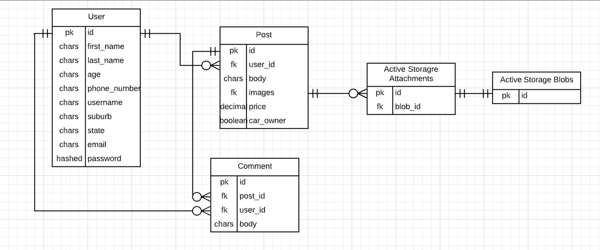

# T2A2 - Marketplace Project

### Deployed website here: https://cars4ads.herokuapp.com/

###	Git Repository here: https://github.com/lukelovekin/LukeLovekin_T2A2

## The Application and its Purpose

Cars4Ads is a webpage designed to connect business owners, great and small, with car owners willing to rent some of their external car space for some extra cash.
Car owners can post ads with attractive details like showing their location, their usual driving routes, how far they drive on average, pictures of their car space with a description of the area of the car that they're happy to use as rent space. Otherwise business owners can also post ads on the webpage showing their advertisement plans for a car, an image, size of the ad, its preferable location i.e the rear window or side doors, prefered area for the ad to be active

There is currently a webpage/business that allows the business owner or the car owner to contact this business via an online application of which then the applicant must wait to be contacted by this website once they have found a candidate. The problem Cars4Ads aims to solve is by allowing the business owners and car owners to deal with each other directly, immediatly, more transparently while cutting out the unnecessarily highly profitable business in the middle. Also, by cutting out the middle man, the car owners and business owners will be able to negotiate on price or set a fixed price in their ads so either of the two can potentially expect to save or make more on the their advertising costs and car rental profits. This problem needs to be solved to help the smaller businesses get into marketing their business more cost effectively and allows them to have more control of where their advertisements get placed and who to, as well as potentially leaving more money in the pockets of both the business and car owner. 

Target audience for Cars4Ads will be, for the car owner users side of the webpage, anybody aged 17 to max driving age looking to make a bit of extra pocket money for going about their day as they would normally. Otherwise any age at all, for anyone looking to advertise their business or product in an easy, low cost way. 

## Functionality and Features

Using Ads4Cars, from the home page, anyone can see all posts created by other users with the ability to filter driver or advertiser only ads. Once the user logs in they can create their own posts as well as contact the owners of other posts, whether its via a comment on their post page or contacting them using their contact details also shown on their post page. The drivers posts will include details about the driver like where they're located, what car they have for advertising, where they travel often as well as the price they're happy to advertise for. The advertisors add will include information like, where they are looking for a driver, ideal size of business logo, price they're willing to pay. Both groups of posters will be able to attach images for a more succesful post. 

Webpage Features

- Create account with a secure password
- Authentication upon sign in
- Authorisation.
    - Allowing only owners of posts to edit and delete their posts
    - Allowing only users signed in to make new posts and comment on others posts
- The ability to create, read, update and delete posts and comments
- View everyones posts on the homepage
- Contacting the owner of an add via comments.
- Filter ads buy driver ads or advertisers ads
- Upload many images to posts to help with the advertisement of an ad.

##	User Stories

MVP User Stories

Users can: 
- Create accounts/profile
- View all post without having to sign up
- Sign in, sign up, log out
- Create, edit, update and delete posts
- Navigate through pages with a top navbar
- Write and view comments to and from other users
- Attach images
- Access basic information about the site
- Filter posts using Driver or Advertiser categories
- Enjoy a nice design

## Sitemap

## Screenshots

Screenshots

##	Wireframes

Homepage

Show Post

Create Post

Signup

## ERD

## Tech stack (e.g. html, css, deployment platform, etc)

Tech Stack

- Ruby on rails 
    - The server-side web framework. A model-view-controller framework that uses Ruby as the programming language
- Ruby
    - Programming language, version 2.7.1
- VsCode
    - Text editor
- Bootstrap & SCSS
    - one of the most popular frameworks for styling and making webpages responsive The code used for styling the website
    - Bootstrap also uses javascript for styling.
- Trello
    -  A Kanban software used to help with project management
- Lucid chart
    - Software used to draw Sitemaps and ERDs and other charts and diagrams
- Postgresql
    - Reltaional database management system which uses Structured query language (SQL) to set up the database and hold data for the webpage. 
- HTML 5
    - A hypertext Markup Language used to structure the web app.

Ruby Gems

Other than rails default gems, gem that were used include
- Devise
    - A very common, battle tested, open sourced gem used to authenticate new and existing user also making it easy for allowing user authorisation to hide certain things from certain users. Devise comes with views and controllers that can be used for almost any webpage
- aws-sdk-s3
    - This gem is needed in conjuction with active storage and Amazons S3 Bucket to store images on the internet

Third Party Services

- Heroku
    - An online deployment website/ server/cloud used for hosting my website
- Github
    - An git repository host online
- Amazon S3 Bucket
    - Stores images on the Amazon AWS cloud keeping image uploads dynamic and keeping the webpage from running slower

##	Explain the different high-level components (abstractions) in your app

Explain the MVC model in full detail
***Precisely explains and shows understanding of the different high-level components of the app***

##	Describe your projects models in terms of the relationships (active record associations) they have with each other

***Describe your project’s models in terms of the relationships (active record associations) they have with each other***
***Complete discussion of the project’s models with an understanding of how its active record associations function***

##	Discuss the database relations to be implemented in your application

***Discuss the database relations to be implementedProvides coherent discussion of the database relations, with reference to the ERD***

###	Provide your database schema design

***PIC AND A DESCRIPTION***
***Provide your database schema design Flawless, complex, complete, and well thought through ERDs provided***

##	Project Planning and Management

Trello Board Link: https://trello.com/b/hsy68wli/cars4ads

Starting with the planning stage of the project, after thoroughly going over the assignments criteria and Rubrik, I started with an Minimum Viable Product (MVP) idea. Starting with a Trello board, I split up the assignment's MVP requirements into To Do cards as well as MVP user stories. The cards include checklists, dates to be completed as well as colour coded labels (red being MVP, most important) to highlight their importance as well as their difficulty/time cost. After the Trello board immediately set up and layout my Git Repositories ready for the rest of the project. In the assignments repo, I layout the README.md with everthing it should include while placing the appropriate "HD" rubrik goals under the matching headings so I know what I should be aiming for when completing the Documentation.

MVP intial Trello board at the start of the project

I refer back to the trello board at least every morning and afternoon, if not every time I finish a task. I move cards that I aim to do on that day into the "Doing" column, move cards into the "Done" column when they are complete as well as constantly adding more User Stories and To Dos to their columns to at least aim to complete.

Once the Trello is up to date with MVP and Repos and Documentations are set up, the rest of the planning will continue, starting with at least a draft of all the documentation requirements including an ERD, Sitemap, Wireframes, functionality and features etc.

After planning stage, I made a start on code, starting with setting up models according to the already planned ERD, I then just keep picking and doing To Do cards from trello board until all MVP To Dos are complete while deploying daily and git pushing often. Once MVP was complete I added so extra features and styling until I was happy enough to submit the assignment

All throughout the day, things that come into mind that will need doing or may cause errors later on are noted on my notepad, commented into my code and usually also noted on my trello in the appropriate area. 

After making sure I have at least attempted a "HD" in all fields, I go over project again to make sure it's all ready and finalised, ready for hand in.
End trello board by the end of the project, once extra cards and features were added.

***INSERT PIC HERE***

======================================

Code comments demonstrate how the queries implemented correctly represent the database structure
6.0 to >5.0 pts
HD
Meets D and all comments are exceptionally written.

Sanitise and validates input to maintain data integrity
6.0 to >5.0 pts
HD
Validates and sanitises all input